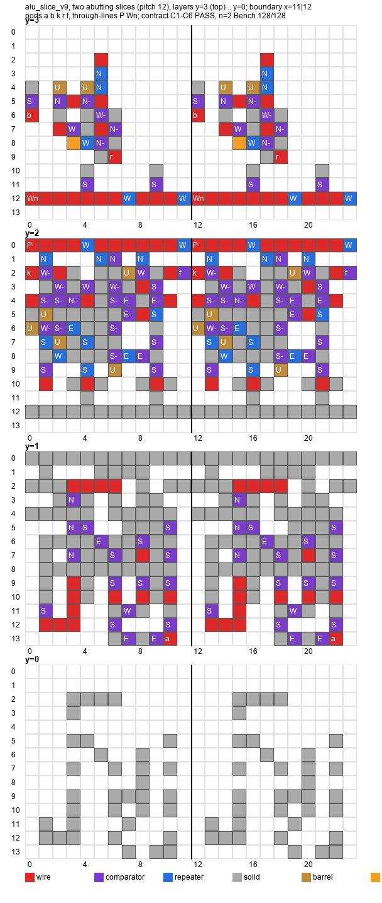

# Jiorimetry

> English: [README.md](README.md)

Minecraft 1.20.6 の redstone 回路を、人が既に知っている回路を書き写すのではなく、**game の
source から書き起こした規則表から導出する**実験的なツールチェーンです。出発点になる規則は DC の
信号強度演算 — comparator、container、dust の減衰、強給電された solid。結果は 3 回検算します。
**Bench**（規則の写し）→ **合成 vanilla world** → オペレータが実際に遊んでいる world。

現在の成果物は 2 つです。

| 成果物 | Bench | 合成 vanilla world | オペレータの world |
|---|---|---|---|
| 1 bit 全加算器 | 8/8 | 8/8、全 read 一致 | 配置して読み戻し 8/8 |
| 1 bit ALU 1 段 `v7`（ADD / SUB / AND / OR。1 段であって tiling できる slice ではない — §3） | 32/32 | 32/32、read 1024/1024 | 配置、静止 comparator 23/23、lever 5 本 + lamp 2 個の給電器で駆動 |
| bit slice `alu_slice_v9`（pitch 12、n=1/2/3 で tiling、契約 checker C1〜C6 PASS） | 32/32、128/128、512/512 | 2 slice: 128/128、read 14,976 点で不一致 0。`feed.py` で無人再現、19,328 点 | 未実施 |
| pitch 14 で Wn 端子を移した bit slice。第二 reviewer が v9 の内部を固定した探索で見つけた（`artifacts/layouts/reviewer_slice_p14_relocated.json`、311 block） | 672/672（n=1/2/3、reviewer の判定器）、当席で 32/32・128/128 | 2 slice: 128/128、read 20,608 点で不一致 0、無人（`feed.py`） | 未実施 |

---

## 1. 方法の実体

1. **規則表。** 逆コンパイルした 1.20.6 の source を読み、行番号を引きながら DC の挙動を人が読める
   表にした物 — `ComparatorBlock`、`ComposterBlock`、`RedstoneTorchBlock`、`RedstoneWireBlock`、
   および solidity の述語。この表は **回路の形を含みません**。[`docs/rules/`](docs/rules) にあります。
2. **代数。** エージェント（書かれた指示だけで動く model の 1 実行単位）に規則表と問い
   （「この部品で全加算器を組め」）を渡すと、明示的な level 符号化を持つ comparator / torch /
   定数 node の *網* が返ります — layout ではありません。網とは別に書いた独立の評価器で検算します。
   [`docs/algebra/`](docs/algebra) を参照。
3. **配置。** 2 つ目のエージェントに幾何の規則表（隣接、dust の形状、斜めの読み、縦の受け渡し）と網を渡し、
   座標を返させます。[`docs/placement/`](docs/placement) を参照。
4. **Bench。** `tools/llmgen/capcell.py` は DC 規則の再実装で、block の一覧を不動点まで解きます。
   エージェントには決して見せない既存の参照回路に対して較正してあります。layout を通す費用はゼロ、1 秒。
5. **合成世界。** layout を、新しい void の 1.20.6 world の region file に、pin 固定の入力ではなく
   物理的な給電器つきで書き込み、headless server で tick させ、freeze/step しながら dust と
   comparator を 1 つ残らず RCON 越しに読み戻します。[`docs/world/`](docs/world) を参照。
6. **オペレータの world。** 同じ block 一覧を実際の save に配置し、region file から読み戻します。

Bench は安い oracle、合成世界は正直な oracle、そして数えるのはオペレータの world です。

---

## 2. 成果

### 1 bit 全加算器（PLACE-1 / WORLD-1）

level 符号化は {0, 5}。comparator 7 個。代数は **プロジェクトの文脈をゼロ** にしたエージェントが出しました
— 渡したのは DC の規則表と問いだけです。

- Bench: 8 入力 vector すべてで `ALL PASS` — [`docs/placement/place1-bench-output.txt`](docs/placement/place1-bench-output.txt)
- 合成世界: 8/8、全 read が Bench の予測と一致、settle 2–10 game tick —
  [`docs/world/world1-tables.md`](docs/world/world1-tables.md)、生データは
  [`artifacts/world/world1.run.result.json`](artifacts/world/world1.run.result.json)
- オペレータの world: 配置して読み戻し、8/8。

### 1 bit ALU 1 段（`alu_stage_v7`）

データ線は {0, 3}。制御線は 2 本: `P` ∈ {0, 15} が算術と論理を選び、`Wn` ∈ {0, 15} が ADD/AND と
SUB/OR を選びます。効いている恒等式は 3 つ:

- `r_SUB = r_ADD = parity(a, b, k)`
- `f = maj(a ⊕ W, b, k)` — carry と borrow を 1 本の線に
- `AND = carry(a, b, 0)`、`OR = carry(a, b, 1)` — 論理演算が carry 比較器 *そのもの*

176 block: comparator 23、repeater 14、dust 35、container 6（level 3 の定数 4 個、level 9 が 2 個）、
redstone_block 1、torch 1、smooth_stone 96。箱は 11 × 3 × 12。

- Bench: `PASS 32/32`、`r` と `f` は正確に {0, 3} に落ちる —
  [`artifacts/rows/alu_stage_v7.json.rows.json`](artifacts/rows/alu_stage_v7.json.rows.json)
- 合成世界: **32/32 行、cell ごとの read 1024/1024 が一致**、settle 2–14 gt —
  [`docs/world/world2-record.md`](docs/world/world2-record.md)、生データは
  [`artifacts/world/world2.run.result.json`](artifacts/world/world2.run.result.json)
- オペレータの world: 176/176 block を配置、静止 comparator 23/23 が一致、駆動状態 3 つを
  region file から読み出し — [`docs/world/live-alu-record.md`](docs/world/live-alu-record.md)
- 93 block の給電器 rig（lever 5 本、composter の定数 4 個、lamp 2 個）で 32 行すべてを手で
  操作できます — [`docs/placement/rig1-result.md`](docs/placement/rig1-result.md)

---

### 追記（2026-09-07、同日後半）: 突き合わせられる bit slice

上の 1 段 v7 は動く 1 段ですが bit slice ではありませんでした。入力 `a` に 3 cell（うち 1 つは
pitch の外）が要り、`P` の第 2 入口と `Wn` の行が through-line になっておらず、東端が閉じて
いませんでした。オペレータは、bit slice の突き合わせと pitch 整合を、2 段目に進む前に満たす必要が
あると裁定しました。そこで slice 契約（`docs/placement/slice-contract.md`）と、layout をその pitch で
n 個並べて n bit の ALU 関数を全入力・全 mode について解く checker（`tools/checks/alu_check_slices.py`）を
書きました。結果 `artifacts/layouts/alu_slice_v8.json`（pitch 12、箱 12x4x14、292 block:
comparator 50、repeater 15、wire 55、barrel 7）: n=1 32/32、n=2 128/128、n=3 512/512、並べた
layout の配置 lint 0。詳細と境界 cell の一覧は `docs/placement/slice1-result.md`、2 slice の層別図は
`artifacts/images/alu_slice_v8_x2_layers.png`。未実施: 2 slice の合成世界での走行と、オペレータの
world での走行。

**第二 reviewer の訂正（2026-09-08）。** Astra が checker を読み、n bit の関数表しか検査していないこと、契約 2 条（through-line の出口を各 slice 内で 15 に戻す）が未測定で `v8` はそれに違反していること（P の出口 9、Wn の出口 12）を指摘しました。契約の各条項を直接測る第二の checker `tools/checks/alu_check_contract.py`（箱、slice ごとの through-line 入口 level、slice ごとの carry level、port の面、境界の組と slice ごとの局所真理値表、lint と repeater の側面 lock）を書き、検査しないものは docstring に明記しました。`v8` はこれに落ちます（512 行で through-line 不一致 1024）。`artifacts/layouts/alu_slice_v9.json` は出口の wire 2 個を west 向き repeater に置き換えたもの（block 数不変）で、両方の checker を通ります: n=1 32/32、n=2 128/128、n=3 512/512、契約 FAIL 0。契約 2 条項を改訂し、改訂は `docs/placement/slice-contract.ja.md` に、詳細は `docs/placement/slice1-result.md` §4（英語）に記録しました。

**合成世界での 2 slice（WORLD-4、2026-09-08）。** `v9` を 2 slice 突き合わせ、給電器 41 block、n=2 の 128 行全部を headless 1.20.6 world で lever 駆動: r0、r1、f、slice 1 の through-line 入口、中間 carry、全 comparator の powered が read 14,976 点すべてで Bench と一致。記録 `docs/world/world4-record.md`、生データ `artifacts/world/world4b1..b3.run.result.json`（rcon 予算のため 3 run に分割）。

### PLACER-0: 規則駆動の配置器と、world が見つけた latch

オペレータは LLM が導出している部分のアルゴリズム化を求め、のちに方向として明言しました: LLM の占有範囲を縮め、最終的に導出そのものをアルゴリズムにする。最初に外した工程は実機段です。`tools/world/feed.py`（FEED-1）は layout を受け取り、各 pin の給電器 cell を探索し、要求から計算した期待値（Bench からではなく）に対して fed layout を Bench で検算し、world と worldprobe の spec を作って走らせ、道具の出力から表を書きます。WORLD-2 と WORLD-4 を無人で再現し、見たことのない slice（reviewer の pitch 14）を 128/128 で走らせました。以後の 13 run は model token 0。記録 `docs/world/feed1-record.md`、仕様 `docs/world/feed1-spec.md`。PLACER-0（`tools/placer0/`、`docs/placement/placer0.md`）はその小さな実証です: ALU の断片から切り出した配置問題 6 つ（pin、出力 cell、禁止 cell、block 予算。`artifacts/placer0/problems.json`）、Bench を oracle にした判定器、DC 規則を逆向きに読んだ手で (部分配置, 未解決の要求) 上を探す IDA*。充足可能な 5 問を人の座標なしで 5/5 解きました（p3 は出題者の誤りで充足不能）。第二 reviewer（Astra）は、探索器と判定器が Bench の規則の穴を共有していると指摘し、大きくする前に 5 解を world で再生するよう求めました。WORLD-4 がそれで、14 行中 13 行が一致し、残る 1 行（`p4_throughline`、T = 0）は latch でした（§6）。Bench を修正し（pin は床、DC 解は cold と hot の 2 seed から）、修正後の判定器は旧 p4 解を落とし、配置器は 0.9 s で gain が減衰する loop の解を出し直しました（`artifacts/placer0/sol_p4_throughline.json`。latch する旧解は `sol_p4_throughline.latched.json` として保存）。




## 3. **主張しない** こと

- **まだ bit slice ではありません。** オペレータは、bit slice の作業 — 隣接する slice の突き合わせと
  pitch 整合 — が未達であると評価し、2 段目を試みる前にそれを満たさなければならないと裁定
  しました。`v7` は 1 段としては動きますが、slice ではありません。正式な slice 契約（+x 方向の
  pitch ≤ 12、各 slice の内側で through-line を 15 に戻すこと、carry の受け渡しが正確に 0/3、
  port は南面か上面のみ、並べたときの閉包）は
  [`docs/placement/slice-contract.md`](docs/placement/slice-contract.md) に書いてあり、`v7` を
  その契約で読むと **20/32** です — 下の再現手順を参照。
- **8 bit の何かはありません。** 多 bit の加算器も ALU も作っていません。
- **時間の主張はありません。** ここにある物はすべて DC / 定常状態です。settle 時間は観測として
  報告しているだけで、モデルではありません。
- 手組みの回路に対する **密度比較・速度比較はしません**。費用は絶対値でのみ報告します。
- **モデルに redstone の予備知識が無かったとは主張しません。** 主張はもっと狭く、検査可能です —
  規則表は source 由来で回路の形を含まない、代数の最初の段は blind で出た、以後の段はこの開発の
  内側で検証した成果物だけを再利用した。§4 を参照。

---

## 4. 由来（各エージェントに何を渡したか）

| 段 | 文脈 | 渡した物 | 渡さなかった物 |
|---|---|---|---|
| DERIVE-2（加算器の代数） | blind、文脈ゼロ | DC の規則表 + 問い | 参照回路、web、他のあらゆる file |
| PLACE-1（加算器の配置） | blind | 幾何の規則表 + DERIVE-2 の網 | 同上 |
| REUSE-1（全減算器） | blind | **byte 一致** の規則表（sha256 `e6001fed…`）、問いだけ差し替え | 同上 |
| ALU-1（ALU の代数） | blind ではない | 規則表 + 上で導いた {0,3} の加算網・減算網 + Astra（第二 model の査読者、GPT-6）による mux の示唆 | 参照回路、source は開けていない |
| PLACE-ALU-3（ALU の配置） | blind ではない | 規則表 v2 + 30/32 で落ちていた前身 + この session の解析 | 参照回路、web |
| RIG-1（給電器） | blind ではない | 上記 + 合成世界の給電器の形 | 同上 |

オペレータ自身の既存の参照回路は、**Bench の較正にのみ** 使いました。設計を出したエージェントには一度も
見せていません。

---

## 5. 再現

Python 3.11 以上、標準ライブラリのみ。Bench の経路にインストールする package はありません。

```
git clone https://github.com/pashina2/jiorimetry.git && cd jiorimetry
```

git を使わない場合: [ZIP でまとめて download](https://github.com/pashina2/jiorimetry/archive/refs/heads/main.zip) して
展開し、展開先の directory で以下の command を実行してください。

### Bench — ALU 1 段 `v7`、32 行

```
$ python tools/checks/alu_check2.py artifacts/layouts/alu_stage_v7.json
LINT L3 wire touches strongly-powered relay (5, 2, 7) relay (4, 2, 7) driven by (3, 2, 7)
LINT L3 wire touches strongly-powered relay (8, 1, 3) relay (7, 1, 3) driven by (6, 1, 3)
LINT L3 wire touches strongly-powered relay (8, 1, 3) relay (8, 1, 4) driven by (9, 1, 4)
LINT L3 wire touches strongly-powered relay (6, 2, 9) relay (5, 2, 9) driven by (5, 2, 8)
LINT L3 wire touches strongly-powered relay (6, 2, 9) relay (6, 2, 8) driven by (6, 2, 7)
LINT L3 wire touches strongly-powered relay (2, 2, 7) relay (2, 2, 6) driven by (2, 2, 5)
LINT L3 wire touches strongly-powered relay (8, 1, 5) relay (8, 1, 4) driven by (9, 1, 4)
LINT L3 wire touches strongly-powered relay (5, 2, 2) relay (5, 1, 2) driven by (5, 1, 1)
LINT L3 wire touches strongly-powered relay (3, 2, 5) relay (3, 1, 5) driven by (3, 1, 4)
PASS 32/32
```

`L1`（vanilla の設置支持）と `L2`（斜めの dust の読み）は hard lint で、0 です。`L3` は情報です。

### Bench — 全加算器、8 行

```
$ python tools/checks/bench_sweep.py artifacts/layouts/layout_place1.json
(0, 0, 0, 'sum', 0, 'cout', 0, 'dec', 0, 0, 'rounds', 3, True, True)
(0, 0, 1, 'sum', 5, 'cout', 0, 'dec', 1, 0, 'rounds', 4, True, True)
(0, 1, 0, 'sum', 5, 'cout', 0, 'dec', 1, 0, 'rounds', 4, True, True)
(0, 1, 1, 'sum', 0, 'cout', 5, 'dec', 0, 1, 'rounds', 3, True, True)
(1, 0, 0, 'sum', 5, 'cout', 0, 'dec', 1, 0, 'rounds', 4, True, True)
(1, 0, 1, 'sum', 0, 'cout', 5, 'dec', 0, 1, 'rounds', 3, True, True)
(1, 1, 0, 'sum', 0, 'cout', 5, 'dec', 0, 1, 'rounds', 3, True, True)
(1, 1, 1, 'sum', 5, 'cout', 5, 'dec', 1, 1, 'rounds', 3, True, True)
ALL PASS
```

### 記録された負の測定 — `v7` を slice として読む

これは **落ちるのが正しい** 測定です。slice の主張を正直に保つための計測です。

```
$ python tools/checks/alu_check_slices.py artifacts/layouts/v7_as_slice.json 1
FAIL OR A 1 B 0 k 0 r [0] f 0 conv True
FAIL OR A 1 B 0 k 1 r [0] f 0 conv True
n=1 PASS 20/32
```

（落ちるのは 12 行で、上に出ているのはその最後の 2 行です。同じ layout は `n=2` では 38/128。）

### 代数の評価器（Bench とは独立）

```
$ python tools/checks/dc_eval.py     artifacts/layouts/net_derive2.json   # ALL PASS
$ python tools/checks/dc_eval_sub.py artifacts/layouts/net_reuse1.json    # ALL PASS
$ python tools/checks/dc_eval_alu.py artifacts/layouts/net_alu1.json      # PASS 32/32
```

### 30/32 の前身と、給電器

```
$ python tools/checks/check_alu_stage.py artifacts/layouts/alu_stage_T6_30of32.json
FAIL SUB (1, 0, 1) r 0 f 3 conv True
FAIL SUB (1, 1, 0) r 0 f 3 conv True
PASS 30/32

$ python tools/checks/alu_check2.py artifacts/layouts/rig1_full_bench.json
PASS 32/32
```

給電器の掃引は回路を **lever の状態だけ** で駆動し — pin 固定の入力を使わずに — pin 版の行を
そのまま再現します。

### 単体試験

Bench とその強度モデルは単体試験を持っており、一緒に写してあります。

```
$ cd tools/llmgen && python -m unittest test_capcell test_strength
.......s....s............s........
----------------------------------------------------------------------
Ran 34 tests in 16.768s

OK (skipped=3)
```

（skip 3 件は fixture 依存の試験で、その fixture は本 export に含まれていません。）

### layout の再生成

`tools/world/make_layout_world1.py` と `make_layout_world2.py` は、段の layout から
`artifacts/layouts/layout_world1.json` と `layout_world2.json` を再生成します。どちらも commit 済みの
file を byte 単位で再現します。

### world の段（利用者が用意する software が要る）

`tools/world/` は実際の server を駆動します。完全性のために同梱していますが、そのままでは
動きません。用意する物（Minecraft 1.20.6 の server jar、Java 21 runtime、RCON を有効にした server
ディレクトリ）は [`tools/README.md`](tools/README.md) を参照してください。jar・save・mod は
一切配布していません。

---

## 6. 報告に値する失敗

- **netlist 方式の合成、27,103 block。** 初期の方式は EDA の pipeline をそのまま借り、算術を gate の
  netlist に切ってから placer に渡しました。placer は net の上で信号強度を運べず、comparator 1 個
  あたり dust 約 158 個を費やし、素朴な baseline より大きい 27,103 block の成果物を作りました。
  修正は「切るのをやめること」— 代数と配置を信号強度のまま一緒に導き、boolean の netlist には
  決して落とさない。
- **T6 が 30/32 で止まり、座標ではなく代数を変えて解けた。** SUB の 2 行が落ちたのは、`x2`
  comparator の side に入力 `a` が合法的に届く cell が無かったためです。幾何的な修正はどれも、
  既に使われている支持 cell と衝突しました。解は代数のその部分を書き換えること —
  `S_x = max(a, W3)`、`as = sub(a, [Wn])`、`xm = sub(S_x, [as])` — と、`P` kill を 1 個の
  comparator の side から共有 side へ移すことでした。これで layout から 1 列がまるごと消え、
  配置不能だった cell も一緒に消えました。
  [`docs/placement/placealu3-result.md`](docs/placement/placealu3-result.md) を参照。
- **給電器の draft は world ではなく Bench で捕まりました。** `draft_1` は 32/32 でしたが斜めの dust
  接続を 14 本持っており L2 制約で棄却、`draft_2` は repeater の背面 cell が air で 20/32。さらに
  給電の cell を 1 つ air のまま残したのは、その真上が強給電された段の relay だからで、これは
  合成世界で学んだ規則を、オペレータの save に block が 1 つも届く前に適用したものです。world
  build 3 回分を費用ゼロで回避しました。
- **notes に記録された運用上の失点** — container を詰めたと報告したが実際は詰まっていなかった
  （2 回）、座標の表を hyphen-minus ではなく U+2212 で打ち、game に拒否された、など。

---

- **held pin は latch を隠す（WORLD-4、`p4_throughline` の T = 0）。** PLACER-0 の解は Bench の判定器も配置器の oracle（同じ Bench）も通ったのに world で latch しました: 解の relay が pin の dust を強給電し、T が一度 15 になると pin が自分で 15 を保つ。Bench が見えなかったのは、pin が回路から持ち上げられない固定値だったこと、そして cold start の反復は第 2 の不動点があっても 0 の不動点に歩くことの 2 つ。どちらも `tools/llmgen/capcell.py` で直しました: pin は床（隣と source の max）、`dc_solve_both` が cold と hot の seed から解いて 2 解が違う cell を報告します（`test_capcell.py` の `FloorAndLatchTests`）。修正後の Bench では旧 p4 が world の latch と同じ T = 0 で BISTABLE になり、この repository の他の layout は全部通ります。この失敗の型は第二 reviewer が走行前に予言し、world が実例を出しました。記録: `docs/world/world4-record.md` §7.1〜7.3。

- **56 gt の減衰を latch と読んだ（FEED-1、解き直した `p4`）。** Bench の修正後に配置器が解き直した `p4` は、1 周ごとに 1 level 落ちる loop を持つ。実機では 3 回の run とも T = 0 で O = 15 のまま、Bench はどの seed からも O = 0 で、spec と観測の衝突として記録した。loop の全 cell を gt ごとに読む trace（`docs/world/p4-decay-trace.md`）で、loop は代数どおりに減衰していた — wire 1 hop で 1 level、1 周 4 gt、14 → 0 に 56 gt — が、どの run も 40 gt で regime を切っていた。DC の判定器は正しく、無いのは時間の条項（整定の上限）。第二 reviewer が境界契約の第 3 条件として挙げていたもので、未実装。

## 7. 実測の費用

**最終段のみ**（2026-09-07: 32/32 → 合成世界 → オペレータの world → 給電器 rig）のエージェント時間と token。
それ以前の段は同じ基準で計測していません。

| 段 | model の class | 実時間 | token |
|---|---|---|---|
| PLACE-ALU-3（32/32 の layout） | Fable | 12 分 | 145k |
| WORLD-2（合成世界の走行） | Opus | 21 分 | 187k |
| PLACER-0（規則駆動の配置器の実証） | Opus | 50 分 | 232k |
| WORLD-4（PLACER-0 の 5 解 + v9 の 2 slice を合成世界で） | Opus | 46 分 | 296k |
| FEED-1（`feed.py`: 実機段を 1 コマンドに。一回払い） | Opus | 2 時間 20 分 | 337k |
| PLACER-1a（pitch 11 の断片探索。BUDGET ×3、配置器の欠陥 2 件） | Opus | 1 時間 17 分 | 290k |
| FEED-1 以後の実機 run 全部（13 run、rcon 360 万回、wall 25 分） | なし | — | 0 |
| in-world の marker 調査 | Sonnet | 3.4 分 | 108k |
| in-world の marker 修正 | Opus | 35 分 | 111k |
| RIG-1（空振り 1 回 + 本番） | Fable | 9 + 15.5 分 | 75k + 192k |
| **合計** | | **エージェント時間 約 1.6 時間** | **約 820k** |

Astra の査読はこの表に入っていません。この計測の外で走っており、実時間も token も測って
いません。したがってこの表は、導出と配置を担ったエージェントの費用であって、結果を形づくった
全エージェントの費用ではありません。

同じ段における人間側の費用: 配置 command 3 回、container の手詰め 6 個、client の再起動 2 回、
lever の操作。

---

## 8. リポジトリの構成

```
docs/rules/        source 由来の規則表（DC、DC v2、幾何、縦の受け渡し）
docs/algebra/      導出された網と、その独立評価器
docs/placement/    layout の導出、30/32 の前身、給電器、slice 契約
docs/world/        合成世界・実 world の記録と cell ごとの表
docs/report-alu-stage.md   ALU 1 段の物語としての記録
artifacts/layouts/ block 一覧と node の網（JSON）
artifacts/programs/ 配置 program
artifacts/rows/    行ごとの真理値表と node 値の表
artifacts/world/   worldprobe の spec と結果（計測値は無改変、実行 metadata は redact 済み — PUBLICATION_CHECKLIST.md §3）、region の capture
artifacts/placer0/ PLACER-0 の問題 6 つと配置器が見つけた解
tools/placer0/     規則駆動の配置器と Bench を oracle にした判定器
tools/world/feed.py 実機段を 1 コマンドに: 給電器の探索、要求に対する Bench 検算、world、spec、走行、表
artifacts/world/feed1/ 上で引いた run の feed.py 出力（spec、worldprobe の結果、表。実行 metadata は redact）
artifacts/images/  層別図と網の図
tools/llmgen/      Bench（capcell）と、その土台の規則機械
tools/checks/      上で使った掃引・checker・評価器
tools/world/       合成世界の生成、RCON probe、region の capture
```

**言語の規約。** 二言語の文書は 1 つの規約に従います: 英語の原本が `name.md`、日本語が
`name.ja.md`、そして各々が冒頭で相手にリンクします。この規約に載っているのは、この README、
4 枚の規則表（`docs/rules/`）、slice 契約、block の網羅表、ALU 1 段のレポート、実 world の記録、
`tools/README.md` です。エージェントが生成した結果 note と world の表 — `docs/algebra/*-result.md`、
`docs/placement/*-result.md`、`docs/placement/placealu2-partial.md`、`docs/world/world*-record.md`、
`world*-tables.md`、`PUBLICATION_CHECKLIST.md` — は英語の原本であり、翻訳は付きません。残りの
短い発注 note（`docs/algebra/` と `docs/placement/` の問い、`docs/alu-place-handover.md`）は、
書かれた当時の日本語の作業記録そのままで、対になる英語版はありません。引用と非公開の材料は
削ってあり、用語を 1 つ揃えてあります（書かれた指示だけで動く model の 1 実行単位を
**エージェント** と呼びます）。数値・座標・file 参照・表は、対になる 2 つの file の間でも、
元の記録との間でも変えていません。

**名前について。** *Jiorimetry — 自織 (jiori, "self-weaving") + -metry.*

---

## 9. クレジット

- **pashina** — オペレータ。回路意味論の裁定、実 world での検証、Bench の較正に使った参照回路。[@pashina_2](https://x.com/pashina_2)
- 導出・配置・道具は、オペレータの指揮下で LLM のエージェント（Claude Fable 5.1 / Opus 5）が作成。
- **Astra** — 第二 model の reviewer（GPT-6、OpenAI）。発注の設計批評、導出した網の独立検算、mux の 2,990 例検算、配置と機械化提案を作り直させた批評。

MIT ライセンス — [LICENSE](LICENSE) を参照。

Mojang / Microsoft とは無関係です。Minecraft は Mojang Studios の商標です。game の code・jar・
world save・mod は、本リポジトリでは一切配布していません。
